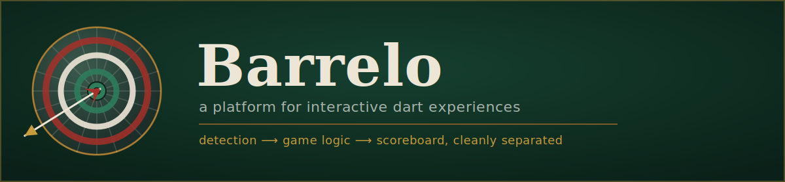
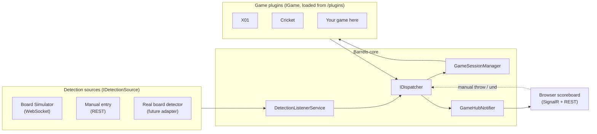

<div align="center">



<br/>


**A dart platform, not a scoring app.** Detection is decoupled from game rules, and game rules are decoupled
from the core — so new games (and new detectors) plug in without touching the platform.

[Overview](#overview) · [Quick start](#quick-start) · [Running a release package](#running-a-release-package) ·
[Playing without hardware](#playing-without-hardware) ·
[Configuration](#configuration) · [Adding a game](#adding-a-new-game) ·
[Adding a detector](#adding-a-new-dart-detector) · [Building your own package](#building-your-own-package) ·
[Project layout](#project-layout) · [Testing](#testing) · [Roadmap](#roadmap)

</div>

---

## Overview

Barrelo is a self-hosted dart platform built around one idea: **detecting a dart, running a game's rules, and
showing a scoreboard are three separate concerns.** Any detector (a real board, a hand-drawn dartboard
clicked in a browser, a mock stream) can drive any game, and any game can be added as a plugin without
recompiling — or even restarting — the core.



**Core principles** (see [`SCOPE.md`](SCOPE.md) for the full vision):

- **Modular** — a game is a DLL dropped in `plugins/`, resolved at runtime. Adding one never means changing
  the core.
- **Detector-agnostic** — every detector, real or simulated, speaks the same `IDetectionSource` contract.
- **Fast & live** — every throw pushes an updated scoreboard over SignalR; no polling, no page refresh.
- **Hardware-optional** — a full match is playable from a browser with no board at all, via a virtual
  dartboard or the standalone Board Simulator.

## Features

- 🎯 **Plugin-based games** — ships with **X01** (301/501/701, double-out) and **Cricket** today; see
  [Adding a new game](#adding-a-new-game) to add your own.
- 🖱️ **Play with zero hardware** — click a virtual SVG dartboard, or drive throws through the standalone
  **Board Simulator** tool over WebSocket.
- ⚡ **Live scoreboard** — every throw, undo, and turn change is pushed to every connected browser instantly
  via SignalR.
- 👥 **Roster & teams** — a drag-and-drop chalkboard for sorting players into teams/spectators, permanent
  players (persisted) and session-only "chalked" players (memory-only, gone when the process restarts).
  Deleted players can be undone within a few seconds.
  <!--  -->
- 🏆 **Session leaderboard** — every completed match awards placement points; a running leaderboard is shown
  in the win banner and can be reset per session.
  <!--  -->
- 🔌 **Dynamic plugin loading** — game DLLs load into a collectible `AssemblyLoadContext` at startup; delete
  or rebuild a plugin independently and the host picks it up without a solution-wide rebuild.
- 🗄️ **Local-first** — SQLite, no external services, no accounts, no cloud. Runs entirely on one machine next
  to the board.

> Screenshots aren't checked in yet — run the app locally (see [Quick start](#quick-start)) to see the
> chalkboard start screen and live scoreboard for yourself, or drop your own into `docs/` and update the
> `` tags above.

## Quick start

### Prerequisites

- [.NET 10 SDK](https://dotnet.microsoft.com/download) (this repo targets `net10.0`; check with `dotnet --version`)
- Any editor — Visual Studio, Rider, or VS Code with the C# extension. The solution file is `Barrelo.slnx`.
- No database server, no Node/npm, no external services required.

### Clone, build, run

```bash
git clone <this-repo-url>
cd Barrelo

# restore + build everything (core, plugins, tools, tests)
dotnet build Barrelo.slnx

# run the API — applies EF Core migrations automatically on startup
dotnet run --project src/Barrelo.Api
```

The API starts at **http://localhost:5295** (see
[`src/Barrelo.Api/Properties/launchSettings.json`](src/Barrelo.Api/Properties/launchSettings.json)) and serves
the web UI itself — open that URL in a browser to reach the chalkboard start screen. In `Development`, an
OpenAPI/Scalar reference is also available at `/scalar`.

Every `dotnet build` of the solution copies each game plugin's compiled DLL and `ui/` assets into
`src/Barrelo.Api/plugins/{gameId}/` automatically (see [`Directory.Build.targets`](src/Games/Directory.Build.targets)) —
there's no separate "install a plugin" step for the games that ship in this repo.

## Running a release package

No .NET SDK, no clone, no build — just download and run:

1. Grab the latest release for your platform from [Releases](../../releases) and unzip it anywhere:
   - Windows: `Barrelo-*-win-x64.zip`
   - Linux (x64): `Barrelo-*-linux-x64.zip`
2. Run the Api:
   - Windows: double-click `Barrelo.Api.exe`, or run it from a terminal in that folder.
   - Linux: zip archives don't preserve the executable bit, so run
     `chmod +x Barrelo.Api tools/BoardSimulator/Barrelo.BoardSimulator` once, then `./Barrelo.Api`.

   It's self-contained — no separate .NET runtime install needed — and applies EF Core migrations to its own
   `barrelo.db` automatically on first launch.
3. Open **http://localhost:5295** in a browser to reach the chalkboard start screen (the same URL as a
   from-source run — see [Configuration](#configuration) to change it).
4. Optional — for board-simulator play, also run the Board Simulator from the unzipped folder (defaults to
   **http://localhost:5250**); the Api is configured to talk to it out of the box:
   - Windows: `tools\BoardSimulator\Barrelo.BoardSimulator.exe`
   - Linux: `./tools/BoardSimulator/Barrelo.BoardSimulator`

   Manual entry via the on-screen dartboard works either way, with or without the simulator running.

The package bundles the built-in game plugins (`plugins/x01`, `plugins/cricket`, `plugins/kickoff`) and the
Board Simulator tool together, so a full match is playable immediately with zero real hardware. Published for
win-x64 and linux-x64. To change ports, database location, or detection mode, edit `appsettings.json` next to
the Api executable — see [Configuration](#configuration).

### Running continuously on Linux (systemd)

For a headless box (e.g. a Proxmox LXC or a Raspberry Pi sitting next to the board), run the Api as a
`systemd` service so it survives reboots and crashes:

```ini
# /etc/systemd/system/barrelo.service
[Unit]
Description=Barrelo dart platform
After=network.target

[Service]
Type=simple
WorkingDirectory=/opt/barrelo
ExecStart=/opt/barrelo/Barrelo.Api
Restart=always
RestartSec=5
Environment=ASPNETCORE_ENVIRONMENT=Production

[Install]
WantedBy=multi-user.target
```

Then `systemctl daemon-reload && systemctl enable --now barrelo`. By default the Api only binds to
`localhost`; to reach it from other devices on your LAN, add `"Urls": "http://0.0.0.0:5295"` to an
`appsettings.Production.json` next to `Barrelo.Api` — see [Configuration](#configuration).

## Playing without hardware

Barrelo is designed to be fully playable with no physical dartboard, in two ways:

1. **Manual entry (always on).** The start screen's virtual SVG dartboard
   ([`wwwroot/dartboard.js`](src/Barrelo.Api/wwwroot/dartboard.js)) posts every click to
   `POST /api/detection/manual-throw`, independent of whichever streaming detector is configured. This is a
   first-class way to play, not a fallback.
2. **Board Simulator (`tools/Barrelo.BoardSimulator`).** A standalone, dependency-free app that stands in for
   a real detector behind the exact same `IDetectionSource` contract a real board adapter would use. Run it
   alongside the API to drive throws over the same WebSocket path a hardware detector eventually will:

   ```bash
   # terminal 1 — the simulator (defaults to http://localhost:5250)
   dotnet run --project tools/Barrelo.BoardSimulator

   # terminal 2 — the API, configured to consume it (see Configuration below)
   dotnet run --project src/Barrelo.Api
   ```

   With `Detection:Mode` set to `Simulator` (the shipped default in
   [`appsettings.json`](src/Barrelo.Api/appsettings.json)), throws made in the simulator's own browser tab
   appear live on any match bound to the simulator board.

## Configuration

All configuration lives in [`src/Barrelo.Api/appsettings.json`](src/Barrelo.Api/appsettings.json) (and the
`.Development.json` override), following standard ASP.NET Core conventions — override any key with an
environment variable (`Detection__Mode=Mock`) or `appsettings.Production.json` for a real deployment.

| Key | Default | Meaning |
|---|---|---|
| `ConnectionStrings:BarreloDb` | `Data Source=barrelo.db` | SQLite connection string. |
| `Plugins:Directory` | `plugins` | Folder (relative to the Api's working directory) scanned for game plugin DLLs on startup. |
| `Detection:Mode` | `Simulator` | Which streaming `IDetectionSource` to run: `Simulator` (Board Simulator over WebSocket) or `Mock` (in-process, driven only by tests/code). Manual REST entry works regardless of this setting. |
| `Detection:Simulator:Url` | `ws://localhost:5250/stream` | WebSocket endpoint of a running `Barrelo.BoardSimulator` instance. |

## Adding a new game

A game plugin is a small class library that references **only** [`Barrelo.GameSdk`](src/Barrelo.GameSdk) —
never `Barrelo.Domain`, `Barrelo.Application`, or `Barrelo.Api`. That one-way boundary is what makes "add a
game" not require touching the core; `Barrelo.Games.X01` and `Barrelo.Games.Cricket` are the two reference
implementations to copy from.

1. **Create the project** under `src/Games/`, e.g. `src/Games/Barrelo.Games.YourGame/`, referencing only
   `Barrelo.GameSdk` and setting `<GameId>` — this is the only MSBuild wiring a new game needs:

   ```xml
   <Project Sdk="Microsoft.NET.Sdk">
     <ItemGroup>
       <ProjectReference Include="..\..\Barrelo.GameSdk\Barrelo.GameSdk.csproj" />
     </ItemGroup>
     <PropertyGroup>
       <TargetFramework>net10.0</TargetFramework>
       <ImplicitUsings>enable</ImplicitUsings>
       <Nullable>enable</Nullable>
       <GameId>yourgame</GameId>
     </PropertyGroup>
   </Project>
   ```

   The shared [`Directory.Build.targets`](src/Games/Directory.Build.targets) picks up `<GameId>` and copies
   the built DLL (plus an optional `ui/` folder) into `Barrelo.Api/plugins/{GameId}/` after every build.

2. **Implement `IGameFactory`** — describes the game to the catalog and creates instances:

   ```csharp
   public sealed class YourGameFactory : IGameFactory
   {
       public const string GameId = "yourgame";

       public GameDescriptor Describe() => new(
           GameId,
           "Your Game",
           "One-line description shown on the start screen.",
           new GameSettingDefinition[]
           {
               // Optional: a GameModeSetting (radio choices merged into GameSetup.Options)
               // and/or a PlayerGroupSetting (declares fixed team buckets, e.g. teams of up to 4).
           });

       public Task<IGame> Create(GameSetup setup, CancellationToken ct)
       {
           if (setup.PlayerIds.Count == 0)
               throw new GameRuleViolationException("Your game requires at least one player.");

           return Task.FromResult<IGame>(new YourGame(setup.PlayerIds));
       }
   }
   ```

3. **Implement `IGame`** — the rules engine. It's **pull-based**: the host calls in
   (`ReceiveThrow`/`ReceiveEndOfTurn`/`UndoLastThrow`) and pulls state out (`GetState`/`GetResult`); a plugin
   never raises callbacks into host code, which is what keeps it safely unloadable from its
   `AssemblyLoadContext`.

   ```csharp
   public interface IGame
   {
       Task ReceiveThrow(DetectedThrow detectedThrow, CancellationToken ct);
       Task ReceiveEndOfTurn(CancellationToken ct);
       Task UndoLastThrow(CancellationToken ct);
       Task<GameStateSnapshot> GetState();
       bool IsComplete { get; }
       Task<GameResult> GetResult();
   }
   ```

   Put whatever your game needs to track (remaining score, marks hit, target progression...) into
   `GameStateSnapshot.Payload` — the envelope itself (`MatchId`, `Status`, `CurrentPlayerId`, `LegNumber`,
   `SetNumber`, `RecentThrows`, `IsComplete`, `WinnerPlayerIds`) is deliberately game-agnostic and must stay
   that way. Throw malformed input as `GameRuleViolationException`; the host turns it into a `400` response,
   never a crash.

4. **Ship a board UI.** Drop a `ui/render.js` next to your game's `.csproj` defining
   `window.renderGameBoard(container, snapshot)` — it's called on every state push with the `#game-board`
   element and the parsed `GameStateSnapshot`, and is what actually draws your game's scores/targets/board
   state. Both `view.js` (the passive TV scoreboard) and `control.js` (the interactive dartboard/scoring
   page) load it the same way. It's technically optional: if `render.js` is missing, they fall back to a raw
   key/value dump of `Payload` so the match is never unplayable, but that fallback is a debugging aid, not a
   real UI — ship a `render.js` for anything you want players to actually look at.

5. **Deploy it.** A game plugin doesn't need to live in this solution at all — `Barrelo.Games.X01` and
   `Barrelo.Games.Cricket` are only wired into `Barrelo.slnx`/`Barrelo.Api.csproj` because they ship as the
   built-in reference games. For any other game, just build your project and copy the output DLL, `render.js`,
   and `style.css` (if any) into `plugins/{gameId}/` next to the running Api:

   ```
   src/Barrelo.Api/plugins/
     yourgame/
       Barrelo.Games.YourGame.dll
       render.js      (optional)
       style.css      (optional)
   ```

   The plugin loader picks it up from there on the next Api startup, and the game appears in the start
   screen's game picker via `GET /api/games` with no core changes and no rebuild of the solution.

### Out-of-process games (any language, any UI engine)

The steps above load a game as a .NET DLL in-process. If you'd rather write a game's rules engine in
Node/Python/anything else, and/or render its board with PixiJS, Phaser, a Unity WebGL build, or any other
engine, use the out-of-process path instead — it's additive alongside the in-process plugin loader above,
not a replacement for it. Barrelo spawns one process per match (never shared across matches) and talks to
it exclusively over plain HTTP/JSON; your process never links against any Barrelo/.NET code.

**Copy [`templates/barrelo-phaser-game`](templates/barrelo-phaser-game) as your starting point** — a
TypeScript + Vite skeleton with all the RPC wiring in place and the actual rules/rendering left as TODOs —
see its own README for setup. What follows is the spec it implements.

1. **Drop a `plugin.json` manifest** in `plugins/{gameId}/` (same folder convention as an in-process
   plugin's DLL) describing the game and how to launch it:

   ```json
   {
     "protocolVersion": 1,
     "gameId": "yourgame",
     "displayName": "Your Game",
     "description": "One-line description shown on the start screen.",
     "settings": [],
     "launch": { "command": "node", "args": ["server.js", "--port", "{{port}}"], "cwd": "." },
     "health": { "path": "/health", "timeoutSeconds": 5 }
   }
   ```

   `settings` is the same `GameSettingDefinition` shape (`GameModeSetting`/`PlayerGroupSetting`) a .NET
   `GameDescriptor` already uses — no separate schema. `{{port}}` in `launch.args` is substituted with a
   free port Barrelo picks per match. Barrelo only ever reads this file to list the game — nothing is
   spawned until a player actually starts a match against it.

   **The containing folder's name must match `gameId` exactly** (`plugins/yourgame/plugin.json` for
   `"gameId": "yourgame"`). The RPC/spawn machinery doesn't care and the game will still play correctly
   either way, but UI assets are fetched from `/plugins/{gameId}/...` — a mismatched folder name silently
   404s `ui/index.html`/`render.js` while the game itself keeps working. Barrelo logs a warning on startup
   if it detects this.

2. **Implement the RPC contract** — one HTTP endpoint per `IGame`/`IGameFactory` method, all JSON, enums as
   strings:

   | Method | Endpoint | Maps to |
   |---|---|---|
   | GET | `/health` | liveness check; response body echoes `protocolVersion` |
   | POST | `/create` | `IGameFactory.Create(GameSetup, ct)` — called once, right after spawn |
   | POST | `/throw` | `IGame.ReceiveThrow(DetectedThrow, ct)` |
   | POST | `/end-turn` | `IGame.ReceiveEndOfTurn(ct)` |
   | POST | `/undo` | `IGame.UndoLastThrow(ct)` |
   | GET | `/state` | `IGame.GetState()` → `GameStateSnapshot` |
   | GET | `/result` | `IGame.GetResult()` → `GameResult` (only meaningful once `IsComplete`) |

   Return `400` with a plain-text/JSON message body for malformed input — Barrelo maps it straight onto
   `GameRuleViolationException`, the same as an in-process plugin throwing it directly. Your process is
   spawned fresh per match and is the sole owner of that match's state for its whole lifetime; it's killed
   the moment the match ends, so there's no multi-match bookkeeping to implement.

3. **Ship a board UI the same way**, but as `ui/index.html` instead of `render.js`: the shell embeds it in
   an `<iframe>` and posts `{ type: "barrelo:gameState", snapshot, playerNames }` into it via `postMessage`
   on every state push, instead of calling a global function. This is what lets the board be PixiJS,
   Phaser, a Unity WebGL build, or anything else — it's fully sandboxed from the host page. (The shell
   tries `ui/index.html` first, then falls back to the `render.js` convention, then the generic payload
   dump — existing in-process games are unaffected either way.)

4. **If a match's process crashes or stops responding**, Barrelo doesn't retry or attempt to resume it —
   the match is marked `Aborted` and the scoreboard shows an explicit "Game interrupted" banner, the same
   way a normal completion shows a win banner. There's no state to resume from anyway, since a process
   holds its match's state only in memory.

Automated tests never spawn an out-of-process game or require Node/Python to be installed — `dotnet test`
exercises the out-of-process plumbing against an in-process HTTP fake instead (see
`tests/Barrelo.Infrastructure.IntegrationTests/GamePlugins/`), keeping the primary correctness gate
pure-.NET.

## Adding a new dart detector

Every detector — a real board, the Board Simulator, manual entry — is just another implementation of
`IDetectionSource` in `Barrelo.Application`:

```csharp
public interface IDetectionSource
{
    IAsyncEnumerable<DetectionEvent> EventsAsync(CancellationToken ct);
    Task<bool> IsConnectedAsync();
}
```

1. **Implement the interface** under `src/Barrelo.Infrastructure/External/Detection/`, using
   [`BoardSimulatorDetectionSource.cs`](src/Barrelo.Infrastructure/External/Detection/BoardSimulatorDetectionSource.cs)
   as the template — connect however your hardware/API talks (WebSocket, HTTP polling, a native SDK), map
   every incoming event onto the canonical, detector-agnostic `DetectedThrow`:

   ```csharp
   public sealed record DetectedThrow(
       Guid ThrowId, int Segment, Ring Ring, int Score, string RawNotation,
       BoardPosition Position, double? Confidence, string BoardId, int? CameraIndex,
       DateTimeOffset DetectedAtUtc, DetectionSourceType Source);
   ```

   Yield a `DetectionEvent` of type `Throw` (carrying the mapped `DetectedThrow`) or `EndOfTurn` for whatever
   your source uses as a turn-boundary signal. `DartScoring.Score(ring, segment)` and
   `BoardGeometry.CenterOf(segment, ring)` in `Barrelo.GameSdk` are available if your source doesn't already
   provide a computed score or a click position.

2. **Wire reconnect/backoff** if the source is a persistent connection — `BoardSimulatorDetectionSource`'s
   exponential-backoff reconnect loop is the pattern to reuse.

3. **Register it behind the `Detection:Mode` switch** in
   [`DependencyInjection.cs`](src/Barrelo.Infrastructure/DependencyInjection.cs):

   ```csharp
   else if (string.Equals(detectionMode, "YourDetector", StringComparison.OrdinalIgnoreCase))
   {
       services.AddSingleton<IDetectionSource>(sp => new YourDetectorDetectionSource(/* ... */));
   }
   ```

4. **Set `Detection:Mode`** to your new value in `appsettings.json` (or an environment-specific override) to
   switch the running `DetectionListenerService` over to it. No changes to any game plugin, endpoint, or UI
   code are needed — the whole platform only ever depends on the `IDetectionSource` abstraction.

## Building your own package

To publish for a different RID, or with your own configuration baked in:

```bash
# self-contained, single-machine deployment (adjust the RID for your target device, e.g. linux-arm64 for a Pi)
dotnet publish src/Barrelo.Api/Barrelo.Api.csproj \
  -c Release \
  -r win-x64 \
  --self-contained true \
  -o ./publish
```

- `dotnet publish` builds every referenced game plugin first (via the build-order-only project references)
  and the `Directory.Build.targets` copy step lands each one in `plugins/{gameId}/` inside the publish
  output — no manual plugin packaging step.
- The app migrates the SQLite database automatically on startup; no separate migration step is needed for a
  fresh deployment.
- Point `Detection:Mode`/`Detection:Simulator:Url` at your target environment via
  `appsettings.Production.json` or environment variables before shipping.
- Run the published `Barrelo.Api` executable (or `dotnet Barrelo.Api.dll` for a framework-dependent publish)
  on the device that sits next to the board — see [Configuration](#configuration) for what to change first.
- Deploying to a home server (e.g. a Proxmox LXC) over SSH? See [`deploy/README.md`](deploy/README.md) for a
  one-command `linux-x64` publish-and-restart script.

## Project layout

```
src/
  Barrelo.Domain              domain entities/value objects — no dependency on GameSdk
  Barrelo.Application         commands/queries, in-house dispatcher, IDetectionSource/IGameCatalog contracts
  Barrelo.Infrastructure       EF Core (SQLite), plugin loader (ALC), detection sources, SignalR notifier plumbing
  Barrelo.Api                 minimal-API endpoints, SignalR hub, static wwwroot UI, plugin static-asset hosting
  Barrelo.GameSdk              dependency-free plugin contracts — the entire boundary a game plugin sees
  Games/
    Barrelo.Games.X01          reference game: classic 301/501/701
    Barrelo.Games.Cricket       reference game: standard Cricket
tests/
  Barrelo.*.UnitTests / .IntegrationTests   one per src/ project, plus tests/Games/* per game plugin
tools/
  Barrelo.BoardSimulator       standalone, zero-Barrelo-dependency stand-in for a real detector
diagrams/                     architecture diagrams (Mermaid)
docs/                         README assets
```

See [`PLAN.md`](PLAN.md) for the full architectural rationale (why an in-house dispatcher instead of MediatR,
why plugins load via a collectible `AssemblyLoadContext`, the detection-source design history, etc.) and
[`SCOPE.md`](SCOPE.md) for the long-term product vision this v1 is scoped down from.

## Testing

```bash
dotnet test Barrelo.slnx
```

Test projects mirror the solution layout 1:1 — `Barrelo.Domain.UnitTests`, `Barrelo.Application.UnitTests`,
`Barrelo.GameSdk.UnitTests`, `Barrelo.Infrastructure.IntegrationTests`, `Barrelo.Api.IntegrationTests`, and
`tests/Games/Barrelo.Games.X01.UnitTests` / `Barrelo.Games.Cricket.UnitTests` for the rules engines. The
integration tests script full matches end-to-end (mock stream and pure manual entry) through the real
dispatcher/plugin-loader stack — the primary correctness gate before any UI change.

## License

Licensed under the [Apache License 2.0](LICENSE).
